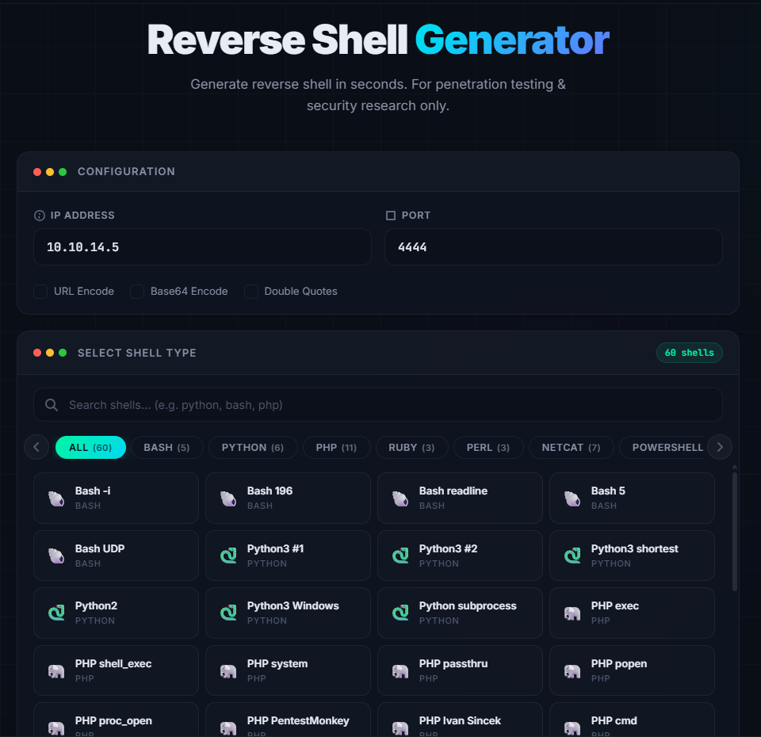

# Reverse Shell Generator

A fast, modern, and client-side web application for generating reverse shell payloads and their corresponding listener commands.
This tool is intended to aid penetration testers and security researchers during ethical engagements.

## 🌟 Features

- **55+ Payloads**: A comprehensive library of shells across multiple languages and tools (Bash, Python, PHP, Ruby, Perl, Node.js, PowerShell, C, Java, Socat, etc.).
- **Smart Listener Suggestions**: Automatically recommends the best listener type (Netcat, Socat, MSFconsole, etc.) based on the payload you select.
- **Dynamic Listener Configuration**: Listener commands auto-update based on your chosen payload and port. It intelligently hides the listener IP field for tools that only require a local binding port.
- **Real-Time Search & Filtering**: Instantly search for specific payloads or filter them by language categories.
- **Encoding Options**: One-click toggles for URL encoding, Base64 encoding, and double-quote substitution.
- **Keyboard Shortcuts**: 
  - Press `/` to focus on the search bar.
  - Press `Ctrl + Shift + C` to quickly copy the generated payload.
- **Zero Server Dependency**: 100% client-side logic using Vanilla HTML, CSS, and JS. Your target IP and ports never leave your browser.

## 🚀 How to Use

Because this is a completely static, single-page application, no backend installation or database is required.

### Getting Started

1. Clone or download this repository.
2. Open the `index.html` file directly in your web browser:
   - Double-click the file, or
   - Start a local server (e.g., `npx serve`, `python -m http.server`) and navigate to `http://localhost:3000` (or whichever port is assigned).

### Generating a Shell

1. **Configure Network**: Enter your local listening IP address and the port you wish to listen on in the top configuration bar.
2. **Select Payload**: Browse the categories or use the search bar to find the payload type you need. Click on a pill to select it.
3. **Configure Options (Optional)**: Toggle URL encoding, Base64 encoding, or quote replacement if your target environment requires it.
4. **Copy Shell**: Click the copy button next to the generated reverse shell payload.
5. **Setup Listener**: The application will automatically suggest a listener type. Adjust the listener type if desired, then copy the generated listener command and run it in your terminal.
6. **Execute**: Execute the copied payload on the target machine to catch the shell on your listener.

## 🛠️ Technologies Used

- **HTML5**: Semantic structure.
- **CSS3 (Vanilla)**: Grid/Flexbox layouts, CSS variables, and Glassmorphism aesthetics (using `backdrop-filter`).
- **JavaScript (ES6+)**: State management, DOM manipulation, and dynamic payload generation.

## ⚠️ Disclaimer

**Educational and Ethical Use Only.** 

This tool is designed specifically for authorized penetration testing, security assessments, and educational purposes. You may only use this tool on networks and systems for which you have explicit, documented permission to test. Unauthorized access to computer systems is illegal. The developers of this tool assume no liability for its misuse.
